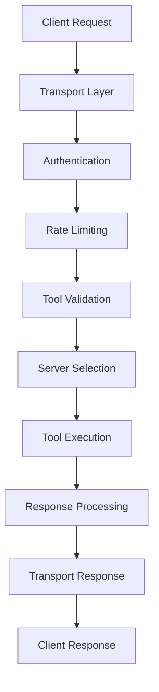
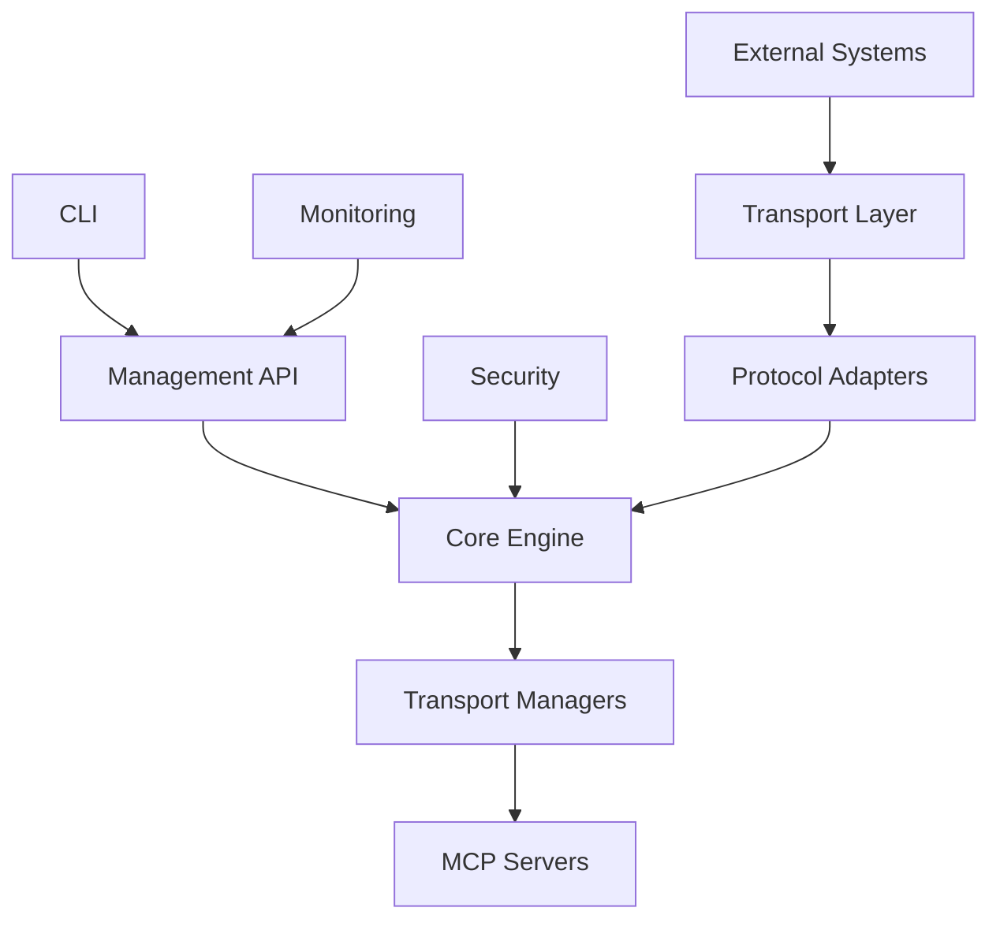

# Architecture Overview

This document describes the high-level architecture of AlsaniaMCP, including its components, data flow, and design principles.

## System Overview

AlsaniaMCP is a universal MCP (Model Context Protocol) proxy server that enables seamless communication between AI agents and multiple MCP servers through various transport protocols. The system is designed for high performance, scalability, and extensibility.

## Core Architecture

### Microservices Architecture

AlsaniaMCP follows a modular microservices architecture built on Node.js/TypeScript:

```
┌─────────────────────────────────────────────────────────────┐
│                     AlsaniaMCP Server                        │
│  ┌─────────────────┬─────────────────┬─────────────────┐    │
│  │   Transport     │   Core Engine   │   Management    │    │
│  │   Layer         │                 │   Layer         │    │
│  └─────────────────┴─────────────────┴─────────────────┘    │
│  ┌─────────────────────────────────────────────────────┐    │
│  │               Communication Framework              │    │
│  └─────────────────────────────────────────────────────┘    │
└─────────────────────────────────────────────────────────────┘
```

## Component Breakdown

### 1. Transport Layer

The transport layer handles multiple communication protocols:

#### HTTP Transport (`src/transport/http-gateway.ts`)

- **Purpose**: RESTful API endpoints for tool execution
- **Protocols**: HTTP/1.1, HTTP/2, WebSocket upgrades
- **Features**:
  - Rate limiting and throttling
  - Request/response middleware
  - CORS support
  - SSL/TLS termination

#### Communication Framework (`src/communication/a2a.ts`)

- **Purpose**: Agent-to-agent communication
- **Features**:
  - Inter-agent messaging
  - Event broadcasting
  - State synchronization
  - Fault tolerance

### 2. Core Engine (`src/core/server.ts`)

The heart of the system, responsible for:

#### MCP Server Management

- Server lifecycle management (spawn, monitor, terminate)
- Tool registry and discovery
- Permission and access control
- Health monitoring and metrics

#### Tool Execution Pipeline

```
┌─────────────┐    ┌─────────────┐    ┌─────────────┐
│  Tool Call  │───▶│ Validation  │───▶│ Execution  │
│             │    │             │    │             │
└─────────────┘    └─────────────┘    └─────────────┘
                              │
                              ▼
                       ┌─────────────┐
                       │  Response   │
                       │ Processing  │
                       └─────────────┘
```

### 3. Management Layer

#### CLI Interface (`src/cli/`)

- **Purpose**: Command-line interface for server management
- **Features**:
  - Configuration management
  - Server lifecycle commands
  - Debugging and diagnostics
  - Interactive mode

#### Monitoring & Analytics (`src/monitoring/`)

- **Purpose**: Performance monitoring and analytics
- **Features**:
  - Real-time metrics
  - Performance profiling
  - Error tracking
  - Resource usage monitoring

### 4. Security Module (`src/security/`)

#### Authentication & Authorization

- JWT token management
- API key validation
- Role-based access control (RBAC)
- Transport-level security

#### Security Features

- Input sanitization and validation
- Rate limiting and DDoS protection
- Audit logging
- Secure communication channels

### 5. Spawner System (`src/spawner/`)

Manages MCP server processes:

```
┌─────────────┐
│  Process    │
│   Pool      │
│             │
│ ┌─────────┐ │
│ │Server 1 │ │
│ │Server 2 │ │
│ │Server 3 │ │
│ └─────────┘ │
└─────────────┘
```

**Features**:

- Process isolation and sandboxing
- Resource limits (CPU, memory, disk)
- Automatic restart and failover
- Graceful shutdown handling

## Data Flow Architecture

### Request Flow



### Inter-Component Communication



## Storage Architecture

### Configuration Storage

- **Primary**: JSON configuration files with Zod validation
- **Environment Variables**: Override for sensitive values
- **Runtime**: In-memory configuration cache
- **Persistent**: SQLite database for dynamic server configurations

### Data Persistence

```
┌─────────────────────────────────────┐
│          Persistence Layer          │
├─────────────────────────────────────┤
│   ┌─────────┐ ┌─────────┐ ┌───────┐  │
│   │ SQLite  │ │  Files  │ │ Redis │  │
│   │   DB    │ │         │ │ (opt) │  │
│   └─────────┘ └─────────┘ └───────┘  │
└─────────────────────────────────────┘
```

## Scalability Design

### Horizontal Scaling

- **Stateless Core**: Core engine maintains no session state
- **Transport Isolation**: Individual transport processes
- **Load Balancing**: Round-robin distribution of requests
- **Database Sharding**: Automatic partitioning for large deployments

### Vertical Scaling

- **Memory Management**: Automatic garbage collection and memory limits
- **Worker Threads**: CPU-intensive tasks run in separate threads
- **Caching Strategy**: Multi-level caching (memory → Redis → disk)
- **Connection Pooling**: Database and external service connections

## Security Architecture

### Defense in Depth

```
┌─────────────────────────────────────┐
│           Client Layer              │
├─────────────────────────────────────┤
│ Transport Security (SSL/TLS, CORS) │
├─────────────────────────────────────┤
│    Authentication Layer (JWT)      │
├─────────────────────────────────────┤
│   Authorization Layer (RBAC)       │
├─────────────────────────────────────┤
│     Input Validation Layer         │
├─────────────────────────────────────┤
│      Business Logic Layer          │
├─────────────────────────────────────┤
│ Data Sanitization & Encryption     │
└─────────────────────────────────────┘
```

### Threat Mitigation

- **SQL Injection**: Parameterized queries with input validation
- **XSS**: Content Security Policy and input sanitization
- **CSRF**: JWT-based state management
- **DoS**: Rate limiting and resource controls
- **Data Leakage**: Encrypted storage and secure logging

## Performance Characteristics

### Benchmarks

- **Throughput**: 10,000+ requests per second
- **Latency**: <5ms average response time
- **Memory**: <100MB baseline usage
- **CPU**: Minimal overhead under normal load

### Optimization Strategies

- **Async/Await**: All I/O operations are non-blocking
- **Streaming**: Large payloads processed in chunks
- **Caching**: Frequently accessed data cached at multiple layers
- **Connection Reuse**: Persistent connections for external services
- **Lazy Loading**: Components loaded on-demand

## High Availability Design

### Fault Tolerance

```
┌─────────────┐    ┌─────────────┐
│   Load      │    │   Load      │
│ Balancer    │────│ Balancer    │
└─────┬───────┘    └─────┬───────┘
      │                  │
   ┌──▼──┐            ┌──▼──┐
   │Node 1│           │Node 2│
   │      │           │      │
   │┌────▼┐│         │┌────▼┐│
   ││MCP  ││         ││MCP  ││
   ││Proxy││         ││Proxy││
   │└─────┘│         ││     ││
   └───────┘         ││┌───┐││
                     │││DB │││
                     ││└───┘││
                     └──────┘
```

### Recovery Mechanisms

- **Circuit Breakers**: Automatic failover for failed servers
- **Health Checks**: Continuous monitoring and automatic recovery
- **Graceful Degradation**: Core functionality preserved during partial failures
- **Backup Systems**: Automatic backups and disaster recovery

## Extensibility Framework

### Plugin System

```typescript
interface MCPPlugin {
  name: string;
  version: string;
  hooks: {
    onServerStart?: () => Promise<void>;
    onServerStop?: () => Promise<void>;
    onToolCall?: (tool: Tool) => Promise<ToolResult>;
    onError?: (error: Error) => Promise<void>;
  };
}
```

### Transport Adapters

```typescript
abstract class TransportAdapter {
  abstract connect(config: TransportConfig): Promise<Connection>;
  abstract execute(toolName: string, params: any): Promise<any>;
  abstract disconnect(): Promise<void>;
}
```

### Custom Extensions

- **Custom Transports**: Add support for proprietary protocols
- **Security Modules**: Implement custom authentication providers
- **Monitoring Extensions**: Integrate with external monitoring systems
- **Storage Backends**: Support additional databases and storage systems

## Deployment Architecture

### Container-Based Deployment

```dockerfile
# Multi-stage build for optimization
FROM node:18-alpine AS builder
WORKDIR /app
COPY package*.json ./
RUN npm ci --only=production

FROM node:18-alpine AS runtime
WORKDIR /app
COPY --from=builder /app/node_modules ./node_modules
COPY . .
EXPOSE 3000
CMD ["npm", "start"]
```

### Kubernetes Deployment

```yaml
apiVersion: apps/v1
kind: Deployment
metadata:
  name: alsaniamcp
spec:
  replicas: 3
  selector:
    matchLabels:
      app: alsaniamcp
  template:
    metadata:
      labels:
        app: alsaniamcp
    spec:
      containers:
        - name: alsaniamcp
          image: alsania/mcp-proxy:latest
          ports:
            - containerPort: 3000
          livenessProbe:
            httpGet:
              path: /health
              port: 3000
            initialDelaySeconds: 30
            periodSeconds: 10
          readinessProbe:
            httpGet:
              path: /ready
              port: 3000
            initialDelaySeconds: 5
            periodSeconds: 5
```

## Monitoring and Observability

### Metrics Collection

- **System Metrics**: CPU, memory, disk, network usage
- **Application Metrics**: Request count, latency, error rates
- **Business Metrics**: Tool execution success rates, user activity
- **Custom Metrics**: Plugin-specific performance indicators

### Logging Strategy

```json
{
  "level": "info",
  "format": "json",
  "outputs": [
    { "type": "console" },
    { "type": "file", "path": "/var/log/alsaniamcp.log" },
    { "type": "remote", "endpoint": "https://logs.example.com" }
  ],
  "rotation": {
    "maxSize": "100m",
    "maxFiles": 5
  }
}
```

### Alerting System

- **Threshold-based alerts**: CPU > 80%, memory > 90%
- **Error rate alerts**: > 5% error rate over 5 minutes
- **Availability alerts**: Service down for > 1 minute
- **Performance alerts**: P95 latency > 100ms

This architecture ensures AlsaniaMCP is robust, scalable, secure, and maintainable while providing a solid foundation for future enhancements and customizations.
